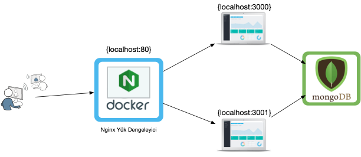

# Nginx Docker Yük Dengeleme: Statik Site
* Full-stack bir uygulamayı 2 farklı sunucuda çalıştırarak Nginx Docker kapsayıcısı ile yük dengeleme yapılmıştır.
* Nginx yük dengeleyici 80 portunda, full-stack uygulamalar 3000 ve 3001 portlarında çalışmaktadır.

## Çalıştırma

* sunucu-1 klasörüne terminalde cd komutuyla girin.
* `npm install` komutu ile bağımlılıkları yükleyin  `npm start` ile uygulamayı çalıştırın.
* sunucu-2 klasörüne terminalde cd komutuyla girin.
`npm install` komutu ile bağımlılıkları yükleyin  `npm start` ile uygulamayı çalıştırın.
* ana klasöre `cd ..` ile çıkın.
* `docker build -t nginxsunucu .` komutu ile nginx sunucu imajını oluşturun.
* `docker run -it --rm -d -p 80:80 --name nginx nginxsunucu` komutuyla nginx yük dengeleyicisini çalıştırın.
* [localhost:80](localhost) adresine giderek sayfayı sürekli yenilediğinizde nginx yük dengeleme algoritmasına göre Mekanbul-1 ve Mekanbul-2 arasında geçiş yapıldığını göreceksiniz.

